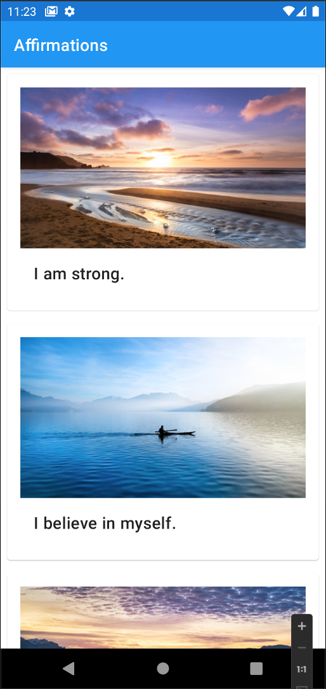
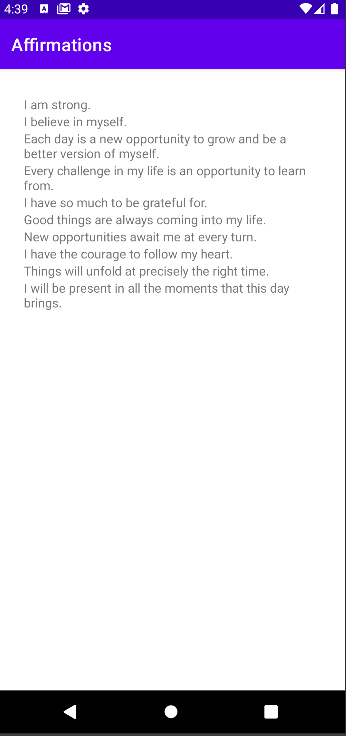

Affirmations App
----------------

**Description**

An Android Application that displays affirmations and images.

Project sourced from: 
- [Display a scrollable list](https://developer.android.com/courses/pathways/android-basics-kotlin-unit-2-pathway-3)

### Screenshots
Screenshots of the project

#### Current view

#### New app icon

#### Starting view

### Technology Stack

- Kotlin
- RecyclerView
  - ItemAdapter
- Material Design 
  - LinearLayout
  - MaterialCardView
   

### How to run Script locally

This sample uses the Gradle build system. To build this project, use the "gradlew build" command or use "Import Project" in Android Studio.

### About the Developer
Jessica Dene Earley-Cha    
[Bio](https://www.jessicadeneearley-cha.com/jessica)   
[Linkedin](https://www.linkedin.com/in/jessicaearley)    